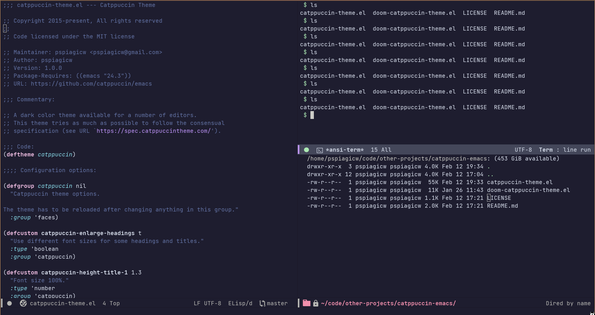

<h3 align="center">
<br/>

Catppuccin for Emacs

</h3>

<p align="center">
<a href="https://github.com/catppuccin/emacs/stargazers"></a>
<a href="https://github.com/catppuccin/emacs/issues"></a>
<a href="https://github.com/catppuccin/emacs/contributors"></a>
</p>

<p align="center">

</p>

## About

This is the port of catppuccin-theme for the Emacs text editor.


## Usage

1. Use either `package.el` or your choice of package manager to install from MELPA.


Using `use-package`
   ```emacs-lisp
   (use-package catppuccin-theme
    :config
    (setq catppuccin-height-title1 1.5))
```


For DOOM Emacs
    
    

2. Use `load-theme` to load `catppuccin` theme


## 🙋 FAQ 

- Q: **_"Is it available on MELPA?"_**

A: Yes , it is available on melpa.
You can install it using package-name `catppuccin-theme`

- Q: **_"Can it be customized?"_**

A: Yes some customization variables are provided.
Use `M-x customize` or using elisp.
    
Customizable variables include
- `catppuccin-alternate-mode-line-and-minibuffer` 
- `catppuccin-enlarge-headings` 
- `catppuccin-height-title{1,2,3}` 

And Many More..


## 💝 Thanks to

- [pspiagicw](https://github.com/pspiagicw)
- [samuelnihbos](https://github.com/samuelnihbos)

&nbsp;

<p align="center"></p>
<p align="center">Copyright &copy; 2021-present <a href="https://github.com/catppuccin" target="_blank">Catppuccin Org</a>
<p align="center"><a href="https://github.com/catppuccin/catppuccin/blob/main/LICENSE"></a></p>
