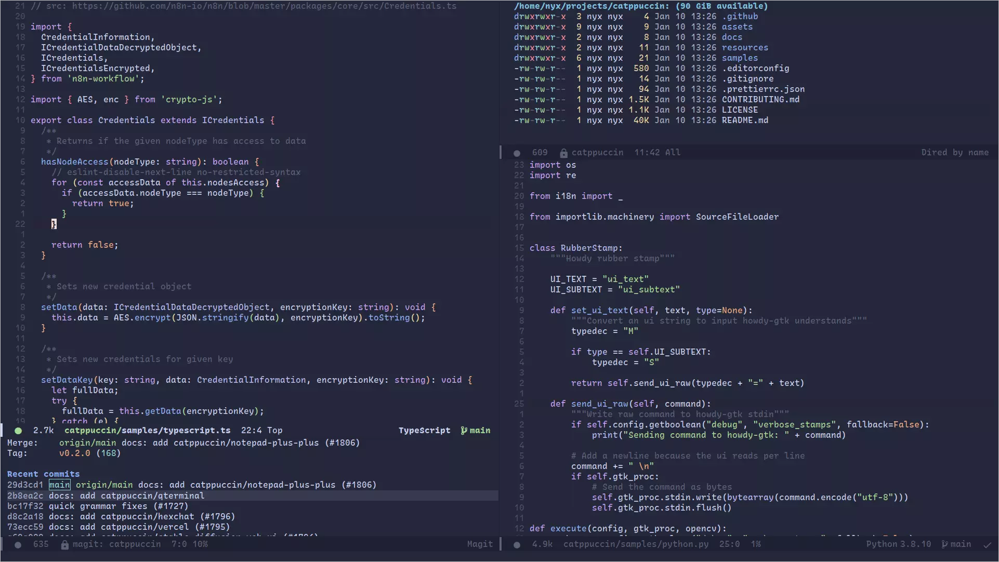

<h3 align="center">
<br/>

  Catppuccin for <a href="https://www.gnu.org/software/emacs/">Emacs</a>

</h3>

<p align="center">
<a href="https://github.com/catppuccin/emacs/stargazers"></a>
<a href="https://github.com/catppuccin/emacs/issues"></a>
<a href="https://github.com/catppuccin/emacs/contributors"></a>
</p>

<p align="center">

</p>

## Previews

<details>
<summary>🌻 Latte</summary>

</details>
<details>
<summary>🪴 Frappé</summary>

</details>
<details>
<summary>🌺 Macchiato</summary>

</details>
<details>
<summary>🌿 Mocha</summary>

</details>

## Installation

1. Download repo locally.

2. Add your theme of choice to:
   `.emacs.d/themes` if you use vanilla emacs or `.doom.d/themes` if you use Doom emacs <i>(If the `themes` folder doesn't exist make a folder with its name)</i>
3. Install autothemer using either package.el or your choice of package manager to install from MELPA.

## Using
In your `.emacs.d` or `.doom.d` add the following lines in `config.el`
```
(use-package autothemer
  :ensure t)

(load-theme 'catppuccin-(mocha, macchiato, frappe or latte go here) t)
```

## 💝 Thanks to

- [pspiagicw](https://github.com/pspiagicw)
- [samuelnihbos](https://github.com/samuelnihbos)
- [konrad1977](https://github.com/konrad1977)
- [Name](https://github.com/NamesCode)

&nbsp;
<p align="center"></p>
<p align="center">Copyright &copy; 2021-present <a href="https://github.com/catppuccin" target="_blank">Catppuccin Org</a>
<p align="center"><a href="https://github.com/catppuccin/catppuccin/blob/main/LICENSE"></a></p>
