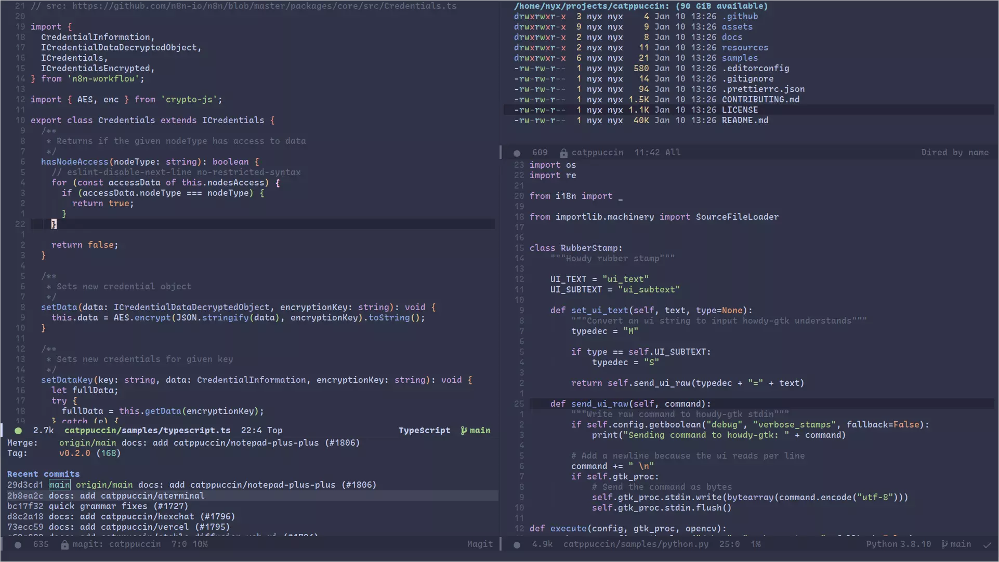
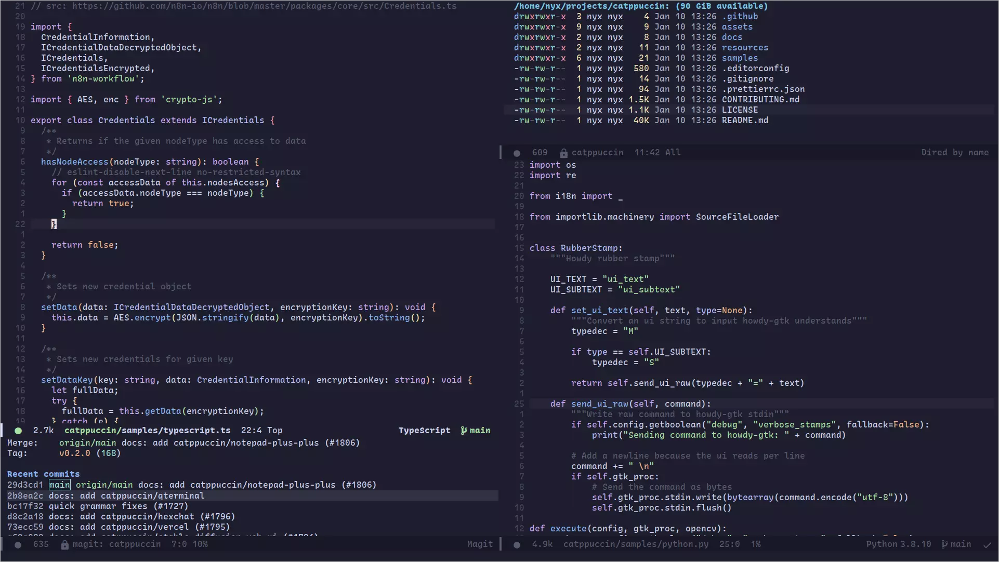

<h3 align="center">
<br/>

  Catppuccin for <a href="https://www.gnu.org/software/emacs/">Emacs</a>

</h3>

<p align="center">
<a href="https://github.com/catppuccin/emacs/stargazers"></a>
<a href="https://github.com/catppuccin/emacs/issues"></a>
<a href="https://github.com/catppuccin/emacs/contributors"></a>
</p>

<p align="center">

</p>

# About

This Emacs theme was made with the [Dracula](https://draculatheme.com/emacs) theme as a base.

## Previews

<details>
<summary>🌻 Latte</summary>

</details>
<details>
<summary>🪴 Frappé</summary>

</details>
<details>
<summary>🌺 Macchiato</summary>

</details>
<details>
<summary>🌿 Mocha</summary>

</details>

# Installation
## Emacs
1. Download `catppuccin-theme.el` into `.emacs.d/themes`
1. Add the following to your `init.el`

``` lisp
(add-to-list 'custom-theme-load-path "~/.emacs.d/themes")
(load-theme 'catppuccin t)
```

## Doom Emacs
1. Download `catppuccin-theme.el` into `.doom.d/themes`
1. Add the following to your `config.el`

``` lisp
(setq doom-theme 'catppuccin)
```

# Configuration

The default flavour is Mocha, to change the flavor, place the following in your `init.el` or `config.el`
after loading the theme
``` lisp
(setq catppuccin-flavor 'frappe) ;; or 'latte, 'macchiato, or 'mocha
(catppuccin-reload)
```

The theme can also be customzied further by changing individual colors
``` lisp
(catppuccin-set-color 'base "#000000") ;; change base to #000000 for the currently active flavor
(catppuccin-set-color 'crust "#222222" 'frappe) ;; change crust to #222222 for frappe
```

## 💝 Thanks to

- [Nyx](https://github.com/nyxkrage)
- [Dracula](https://draculatheme.com/emacs)
- [pspiagicw](https://github.com/pspiagicw)
- [samuelnihbos](https://github.com/samuelnihbos)
- [konrad1977](https://github.com/konrad1977)
- [Name](https://github.com/NamesCode)

&nbsp;
<p align="center"></p>
<p align="center">Copyright &copy; 2021-present <a href="https://github.com/catppuccin" target="_blank">Catppuccin Org</a>
<p align="center"><a href="https://github.com/catppuccin/catppuccin/blob/main/LICENSE"></a></p>
