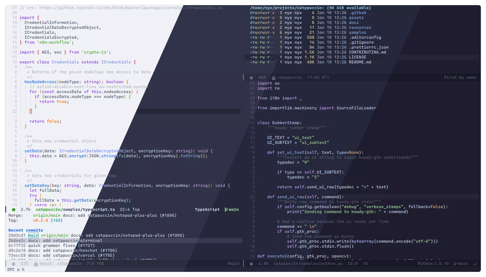
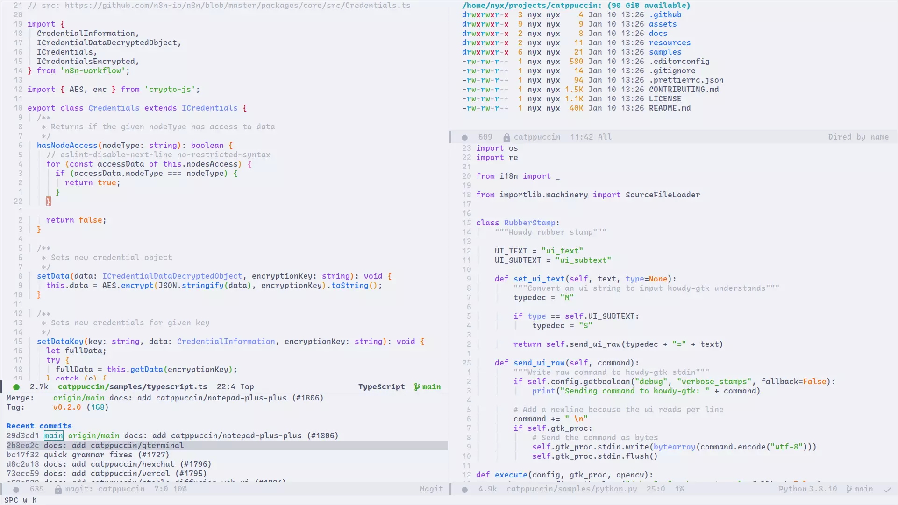

<h3 align="center">
<br/>

  Catppuccin for <a href="https://www.gnu.org/software/emacs/">Emacs</a>

</h3>

<p align="center">
<a href="https://github.com/catppuccin/emacs/stargazers"></a>
<a href="https://github.com/catppuccin/emacs/issues"></a>
<a href="https://github.com/catppuccin/emacs/contributors"></a>
</p>

<p align="center">

</p>

# About

This Emacs theme was made with the [Dracula](https://github.com/dracula/emacs) theme as a base.

## Previews

<details>
<summary>🌻 Latte</summary>

</details>
<details>
<summary>🪴 Frappé</summary>

</details>
<details>
<summary>🌺 Macchiato</summary>

</details>
<details>
<summary>🌿 Mocha</summary>

</details>

# Installation

`catppuccin-theme` is available on the MELPA package repository.

## Emacs

1. Make sure to have MELPA enabled by adding it to the `package-archives`, or that your package manager of choice has MELPA as a repository.
2. You can then install the package from the `list-packages` interface, accessible from `M-x list-packages`.
3. Alternatively, you can install the package using your package manager of choice, such as straight

```lisp
(straight-use-package 'catppuccin-theme)
```

4. Then, you can enable it by adding the following to your `init.el` file

```lisp
(load-theme 'catppuccin :no-confirm)
```

## Doom Emacs

1. Add the following to your `package.el`

```lisp
(package! catppuccin-theme)
```

2. Add the following to your `config.el`

```lisp
(setq doom-theme 'catppuccin)
```

## Spacemacs

1. Add catppuccin-theme to the dotspacemacs-additional-packages list
2. Set dotspacemacs-themes to catppuccin
3. Configure your flavor in the user-init function:

```lisp
(defun dotspacemacs/layers ()
  (setq-default 
   dotspacemacs-additional-packages '(catppuccin-theme)))

(defun dotspacemacs/init ()
  (setq-default
   dotspacemacs-themes '(catppuccin)))

(defun dotspacemacs/user-init ()
  (setq catppuccin-flavor 'frappe))
```

# Configuration

The default flavour is Mocha, to change the flavor, place the following in your `init.el` or `config.el`
after loading the theme

```lisp
(setq catppuccin-flavor 'frappe) ;; or 'latte, 'macchiato, or 'mocha
(catppuccin-reload)
```

The theme can also be customzied further by changing individual colors.
Doom users must call `(load-theme 'catppuccin t t)` before being able to call any of the `catppuccin-*` functions.

```lisp
(catppuccin-set-color 'base "#000000") ;; change base to #000000 for the currently active flavor
(catppuccin-set-color 'crust "#222222" 'frappe) ;; change crust to #222222 for frappe
(catppuccin-reload)
```

>[!NOTE]
>If you are using emacsclient and rustic, you should add `(add-hook 'server-after-make-frame-hook #'catppuccin-reload)` to your config to avoid [this issue](https://github.com/catppuccin/emacs/issues/121)

>[!NOTE]
>If you are using doom emacs and want to customize the `catppuccin-flavor`, calling `(catppuccin-reload)` after `load-theme` may slow emacs startup time. To change the flavor, it is sufficient to `setq` the desired flavor before loading the theme. Then, calling `(catppuccin-reload)` can be omitted because catppuccin will be loaded with the desired flavor directly.

## 💝 Thanks to

- [Nyx](https://github.com/nyxkrage)
- [Dracula](https://github.com/dracula/emacs)
- [pspiagicw](https://github.com/pspiagicw)
- [samuelnihbos](https://github.com/samuelnihbos)
- [konrad1977](https://github.com/konrad1977)
- [Name](https://github.com/NamesCode)

&nbsp;

<p align="center"></p>
<p align="center">Copyright &copy; 2021-present <a href="https://github.com/catppuccin" target="_blank">Catppuccin Org</a>
<p align="center"><a href="https://github.com/catppuccin/catppuccin/blob/main/LICENSE"></a></p>
